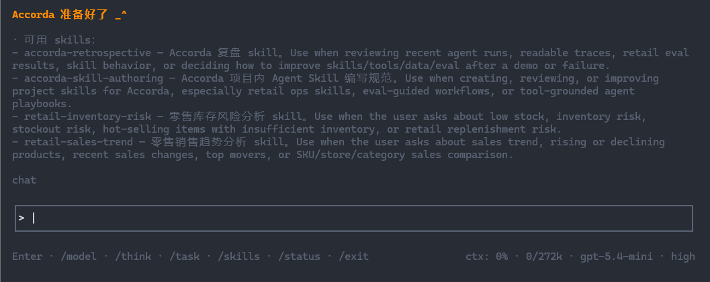
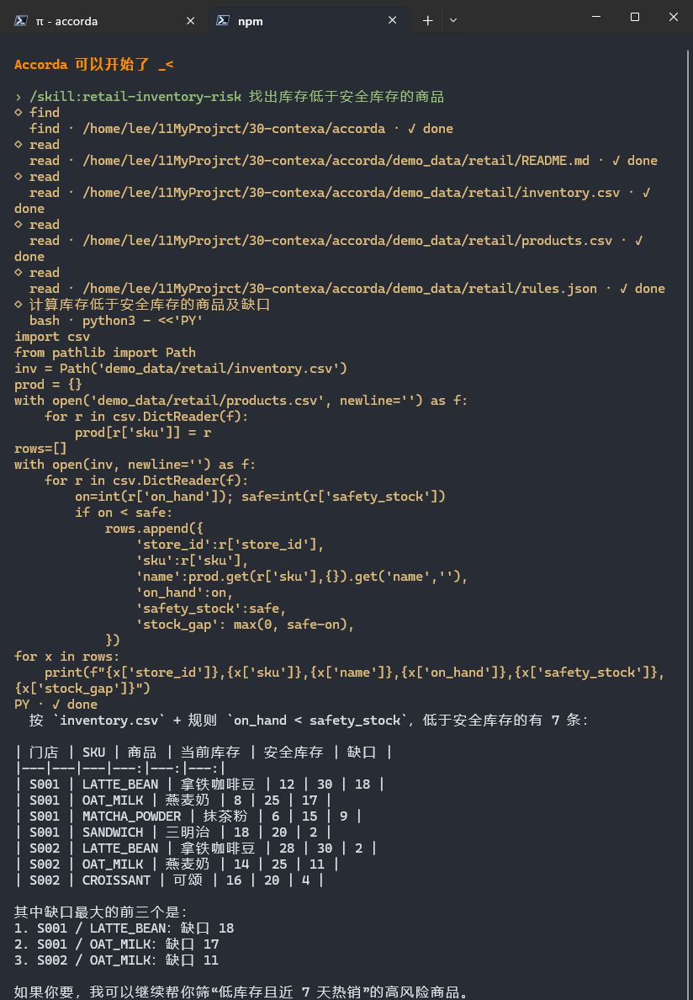
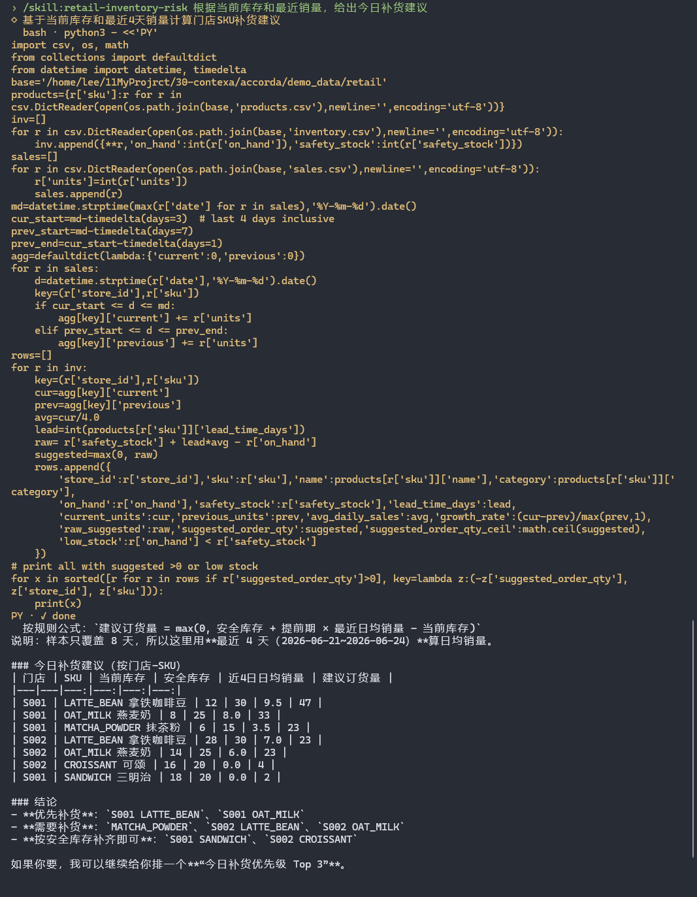
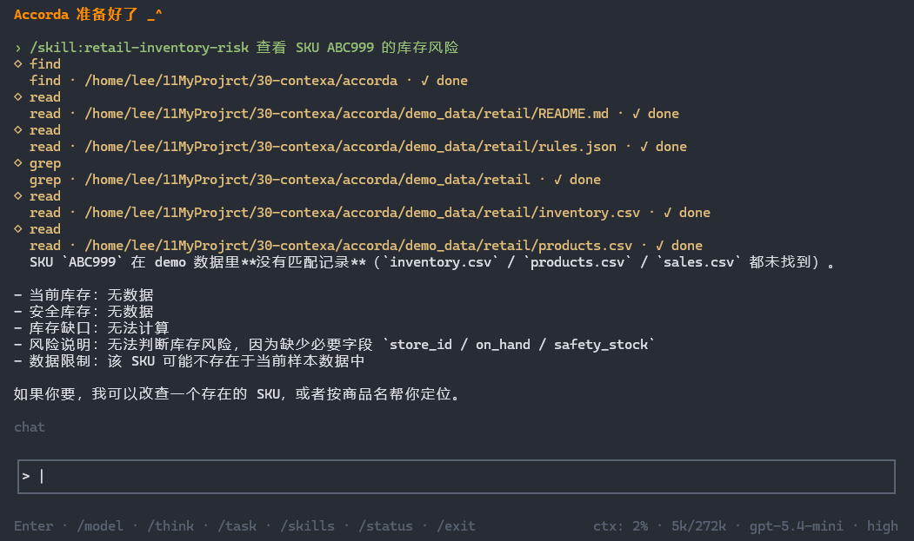
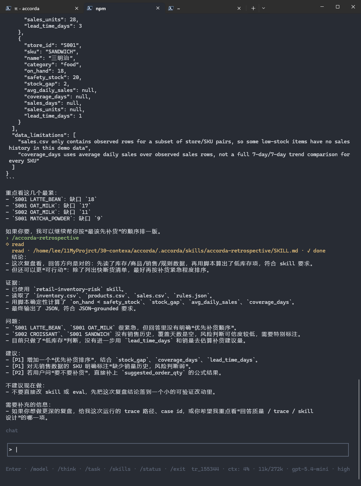

# Accorda

## 实际运行截图

- level1 测试(见`assets/`)


---



- case6-失败截图 + level2 + retrospective(回顾)skill



---

截图展示了 Agent workflow：用户通过 `/skill:<name>` 激活项目级 skill，Agent 读取 Retail mock 数据，用 `bash`/脚本做确定性计算，再输出 JSON-grounded 中文结论。运行后可用 trace-based eval 检查这次eval是否访问了正确数据、调用了正确工具、避开了禁止结论。

---
---

**Accorda** 是一个基于 Pi SDK 的 Agent Runtime 产品层。它不重新实现模型 provider、认证、session 和 tool calling，而是在 Pi SDK 之上构建 project skills、Intent-aware tools、Readable Trace、Task Mode 和 eval-driven business demo。

当前 demo 重点是 **Retail Ops Agent**：用 mock 零售数据验证库存风险、销售趋势、补货建议等业务场景，展示一个可追踪、可评估、可迭代的 Agent workflow。

```text
用户问题 → Agent Skill → 数据读取 → 确定性计算 → JSON-grounded 回答 → Readable Trace → Eval / Retrospective
```

## 亮点

- **复用 Pi SDK 底层能力**：模型、认证、session、tool calling 交给 Pi SDK；Accorda 聚焦 runtime 产品层。
- **Project-isolated Skills**：只加载 `.accorda/skills/`，避免全局 skills 污染 prompt，保证 demo/eval 可复现。
- **Skill 作为场景方法论**：Retail skills 描述适用场景、必要事实、计算公式、输出格式和失败兜底，而不是固定 tool script。
- **Intent-aware Tools**：`bash/edit/write/append` 必须声明 `intent`，trace 记录“为什么做”，不只是记录命令。
- **Readable Trace**：trace 面向人类阅读，只记录 intent、target、summary、status，不复制完整 raw dump。
- **JSON-grounded Answer**：业务分析先产出结构化 JSON，再生成中文回答，降低“工具算对但模型转述错”的风险。
- **Eval-driven Demo**：先定义 Level 1/Level 2 eval cases，再反推 mock 数据、skills 和验证方式。
- **Quality Loop**：数据校验、eval readiness、retrospective skill 组成轻量改进闭环。
- **延迟抽象 Retail Tools**：第一版故意用 `read/bash` 验证 workflow，等重复模式稳定后再决定是否抽工具。


## 项目结构

```text
src/pi/          Pi SDK TUI、extension、配置隔离
src/trace/       readable trace
src/eval/        Retail data validation / eval readiness
.accorda/skills/ 项目级 Agent Skills
demo_data/retail/ Retail Ops mock 数据
eval/            eval cases 与评估说明
agent_docs/      阶段记录与排障文档
CONTEXT.md       项目术语表
```

## 当前验证结果

Retail Ops Demo 已完成 Level 1 手动验证，6 个固定业务 case 均通过：

| Case | 验证点 | 结果 |
| --- | --- | --- |
| 低库存检查 | 读取库存/商品数据，计算 `on_hand < safety_stock` 和 `stock_gap` | 通过 |
| 热销但库存不足 | 读取销售/库存/商品数据，计算销量变化和低库存交集 | 通过 |
| 销售趋势分析 | 按 SKU 聚合销量，计算 `current_units`、`previous_units`、`growth_rate` | 通过 |
| 滞销高库存 | 结合库存倍数和近期销量识别高库存低动销商品 | 通过 |
| 补货建议 | 基于库存、销量、提前期和规则公式计算建议量 | 通过 |
| 不存在 SKU 兜底 | 对 `ABC999` 正确说明无匹配，不编造数据 | 通过 |

已验证的系统行为：

- Agent 能通过 `/skill:<name>` 加载项目级 skill。
- Agent 会读取 `demo_data/retail/` 中的事实数据。
- 关键指标由 `bash`/脚本确定性计算，不靠模型脑补。
- 输出能引用具体 SKU、库存、安全库存、增长率等结果。
- 缺失数据场景能兜底，不编造商品或采购状态。

静态质量检查当前也通过：

```bash
npm run retail:validate-data
npm run eval:retail
```

`retail:validate-data` 通过，并提示 2 个可接受 warning：`SANDWICH`、`ESPRESSO_CUP` 暂无销售记录。  
`eval:retail` 通过，当前评估集包含 8 个 case：Level 1 为 6 个，Level 2 为 2 个。


## 检查链路

Accorda 的评估不是只看最终回答，而是把一次 Agent run 拆成几层证据来检查：

```text
Data Validation → Eval Readiness → Agent Run → Trace-based Eval → Retrospective
```

### 1. Data Validation

先确认底层数据没坏：

```bash
npm run retail:validate-data
```

检查 CSV/JSON 是否存在、字段是否完整、SKU 是否能对上、数值是否合理。

### 2. Eval Readiness

再确认评估集本身可用：

```bash
npm run eval:retail
```

检查 `eval/retail_cases.json` 里的 case、expected skill、expected data files 是否和项目文件对齐。

### 3. Agent Run

用 TUI 手动跑 case，例如：

```text
/skill:retail-inventory-risk 找出库存低于安全库存的商品
```

运行后会生成 readable trace：

```text
.accorda/pi-runs/<trace-id>/trace.jsonl
```

### 4. Trace-based Eval

用 trace 检查这次运行有没有走对 workflow：

```bash
npm run eval:retail:trace -- low-stock-basic .accorda/pi-runs/<trace-id>/trace.jsonl
```

它检查的是运行证据：

- 是否使用了期望 skill
- 是否访问了期望数据文件
- 是否调用了 `bash` 做确定性计算
- 是否避开 forbidden mentions
- 是否有 JSON-grounded evidence

注意：Readable Trace 当前不保存完整 assistant answer / tool output，所以 expected mentions 和 JSON evidence 是 soft checks，可能显示 warning。它的目标不是完整语义评分，而是检查这次运行是否有关键过程证据。

### 5. Retrospective

如果某次运行出现 warning/fail，可以用复盘 skill 分析原因：

```text
/skill:accorda-retrospective 根据这次 Retail eval 和 trace 结果提出改进建议
```

它只提出改进建议，不自动修改代码或 skill。

## Q&A

### 为什么不用真实零售数据？

当前阶段用 mock 数据是为了可控评估。我们需要明确知道哪些 SKU 应该低库存、热销、滞销或不存在，这样才能验证 Agent 是否按预期工作。真实数据可以后续替换为新的 data source/tool。

### 为什么现在还没有 Retail Tools？

这是刻意延迟抽象。第一版先用 `read/bash` 验证 workflow，避免过早设计错误工具边界。等重复查询和计算模式稳定后，再抽 Retail Tools。

### 为什么 trace-based eval 会有 warning？

Readable Trace 为了可读性，不保存完整工具输出和完整回答。因此它能检查 workflow evidence，但不能完整检查自然语言答案。expected mentions 和 JSON evidence 目前是 soft checks。

### 怎么防止模型把数字转述错？

Retail skills 要求先产出结构化 JSON，再生成中文回答，并要求最终回答只引用 JSON/原始数据中的 SKU 和数字。后续可以进一步通过 artifact 或 verifier 做自动校验。

### Task Mode 和 Skill 是什么关系？

Task Mode 管可见任务状态；Skill 管领域 workflow。两者不互相替代。复杂任务可以进入 Task Mode，同时加载合适 skill。

## 快速运行

```bash
npm install
npm run pi:dev
```

TUI 常用命令：

```text
/model        切换模型
/think        切换 thinking level
/status       查看实际模型、配置和 skill scope
/skills       查看项目 skills
/task <目标>  进入 Task Mode
/exit         退出
```

单次运行：

```bash
npm run pi:once -- "hello"
npm run pi:once -- --task "检查项目状态"
```

## Retail Ops Demo

项目内 skills：

```text
.accorda/skills/retail-inventory-risk/SKILL.md
.accorda/skills/retail-sales-trend/SKILL.md
.accorda/skills/accorda-skill-authoring/SKILL.md
.accorda/skills/accorda-retrospective/SKILL.md
```

示例输入：

```text
/skill:retail-inventory-risk 哪些商品最近销量上涨但库存不足？
/skill:retail-sales-trend 分析最近销售趋势，找出上涨和下降最明显的商品
```

数据：

```text
demo_data/retail/sales.csv
demo_data/retail/inventory.csv
demo_data/retail/products.csv
demo_data/retail/rules.json
```


## Eval / Quality

校验 Retail mock 数据：

```bash
npm run retail:validate-data
```

检查 eval cases、skills 和数据文件是否对齐：

```bash
npm run eval:retail
```

对一次真实运行的 trace 做证据检查： 

(`eval:retail:trace` 是 case-driven evaluator，只适用于 `eval/retail_cases.json` 中定义的 Retail cases。它不是通用答案评分器。)

```bash
npm run eval:retail:trace -- <case-id> .accorda/pi-runs/<trace-id>/trace.jsonl
```

评估材料：

```text
eval/retail_cases.json
eval/retail/README.md
eval/retail/level2-manual-test.md
```

## Trace 与本地配置

Pi 配置隔离在：

```text
.accorda/pi-agent/
```

首次运行会从 `~/.pi/agent/` 复制 `auth.json`、`models.json`、`settings.json`。

Readable trace 写入：

```text
.accorda/pi-runs/<trace-id>/trace.jsonl
```

## 当前边界

- Retail 数据是 mock 数据，用于可控 eval，不代表真实业务数据。
- `eval:retail` 当前是 readiness check，不是完整自动模型评测。
- Retail workflow 当前主要使用 `read/bash` 做事实读取和确定性计算，暂未抽专用 Retail Tools。
- v1 不做 permission gate，只强制高风险工具提供 intent 并记录 trace。关于此可以使用我另外开发的`pi-guard-sandbox`插件来实现自定义审批要求
- 旧 Stage 1 / Stage 2 runtime 仍保留，但不是当前主线。
