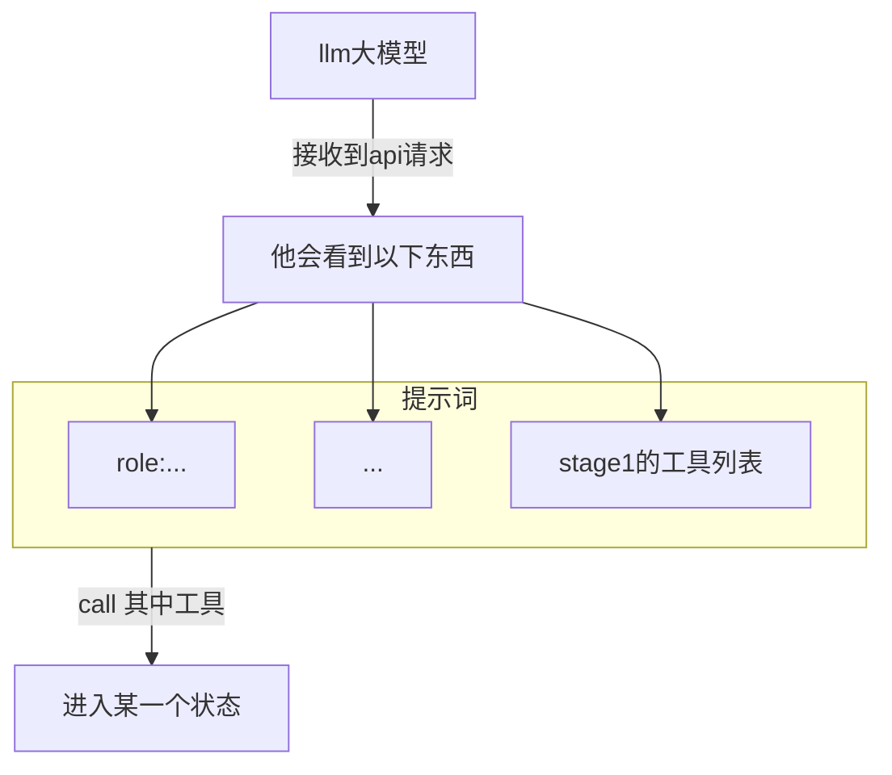

```mermaid
graph TB
2c7a86d1-fca9-47f7-9556-bf203104e5b4["llm大模型"]
a5fa9d7e-8c76-4042-9ade-77b14c4a6486["他会看到以下东西"]
129fd5eb-e107-4f10-95a1-89b583575916["role:..."]
17c41e20-3b02-4dc1-ae58-b74bb18c0740["..."]
e298ab6c-9827-417d-9c73-b66bb76608b7["stage1的工具列表"]
subgraph 11680a25-844c-4380-ab7c-d83f2ed1c7e3["提示词"]
129fd5eb-e107-4f10-95a1-89b583575916["role:..."]
17c41e20-3b02-4dc1-ae58-b74bb18c0740["..."]
e298ab6c-9827-417d-9c73-b66bb76608b7["stage1的工具列表"]

end
847e87c8-1702-4be0-b8c5-a2a9e3b6c6a3["进入某一个状态"]
a5fa9d7e-8c76-4042-9ade-77b14c4a6486 --> 129fd5eb-e107-4f10-95a1-89b583575916
a5fa9d7e-8c76-4042-9ade-77b14c4a6486 --> 17c41e20-3b02-4dc1-ae58-b74bb18c0740
a5fa9d7e-8c76-4042-9ade-77b14c4a6486 --> e298ab6c-9827-417d-9c73-b66bb76608b7
2c7a86d1-fca9-47f7-9556-bf203104e5b4 --> |接收到api请求| a5fa9d7e-8c76-4042-9ade-77b14c4a6486
11680a25-844c-4380-ab7c-d83f2ed1c7e3 --> |call 其中工具| 847e87c8-1702-4be0-b8c5-a2a9e3b6c6a3
```